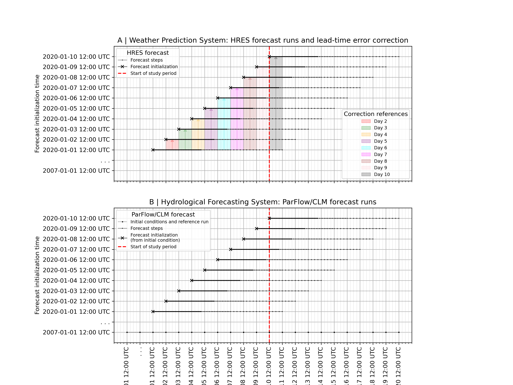

## Idea: 
There is a decay in the accuracy of longer lead times in precipitation forecasts. The idea is to train various deep learning (DL) networks to learn the longer lead time errors (e.g., up to 240 hours) against the first 24-hour period used as a reference. This method aims to improve the overall forecast accuracy by learning from mismatches in longer lead times against the initial 24-hour period.



The figure illustrates forecast lead time error correction over using various DL models. For example, different forecast run times are shown for HRES runs. The x axis represents the forecast steps in date and time, and the y axis represents the forecast initialization dates.

**Forecast runs**: Lines represent forecast runs starting every day (Initialization date). 

**Correction reference**: Arrows indicate the correction applied by the DL models at the 24-hour mark. These arrows highlight each forecast run corrected based on the first 24 hour forecast (correction reference).

**Forecast steps**: Precipitation forecast initialized at a specific date and time with run for every hour up to 90 hours, then every 3-hours up to 150 hours, and every 6-hours up to 240 hours.

## Start from here: 

### Modify the environment and directories based on your working system: 
Modify `bashenv`, `bashenv-train`, `directories.py`, and `directories.sh` accordingly. 

### Run `run_all_jobs.sh` for automating the sequential submission of Slurm batch jobs:
It submits a series of batch scripts ensuring that each script starts only after the previous one has completed successfully. The script uses job dependencies to manage the execution order.

```
./run_all_jobs.sh
```

### Run `HRES_PREP.sh` for preprocessing HRES data: 
This script automates the preprocessing of HRES forecast data. It copies, adjusts, and merges data files, organizing them into daily forecasts. Finally, it adds metadata attributes to the processed data before output. 

### Run `DL_PREP.py` using `run_DL_PREP.sh` for preparing the data for training and production in DL: 
This script utilizes argparse to specify lead time, specifications, unique filenames based on parameters, and prepares training and production data. 

### Run `DL_TRAIN.py` using `run_DL_TRAIN.sh` for training: 
This script defines training hyperparameters using argparse and prepares data for model training. It loads training data, constructs TensorFlow datasets, initializes a UNet model, compiles it with the Adam optimizer, and defines callbacks for model checkpointing and early stopping. It then trains the model using defined datasets and saves the results. 

### Run `DL_PREDICT.py` using `run_DL_PREDICT.sh` for prediction: 
This script loads production data, initializes the trained DL model, loads trained weights, and predicts mismatches using the pretrained weights for each lead-time model. 

### Run `HRES_POST.sh` and `HRES_POST2.sh` using `run_HRES_POST.sh` for post-processing the corrected data:
This script returns the data format back to the original ECMWF format.

### Use `VISTAB.ipynb` to visualize results
